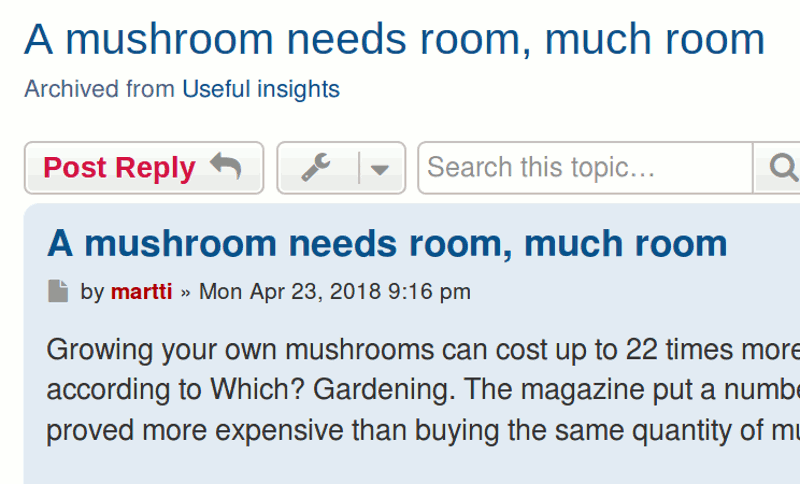
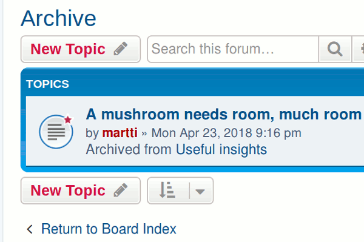
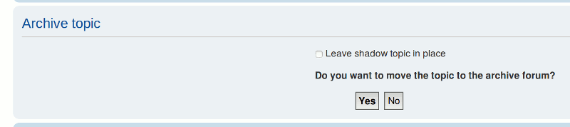
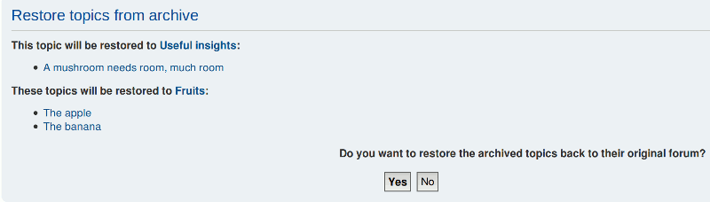
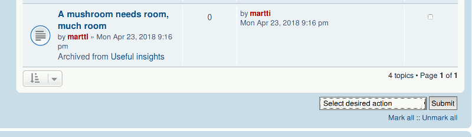
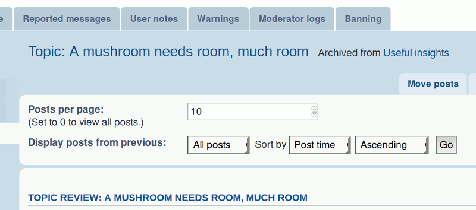
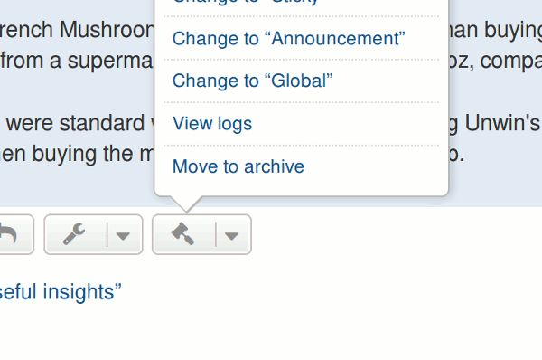
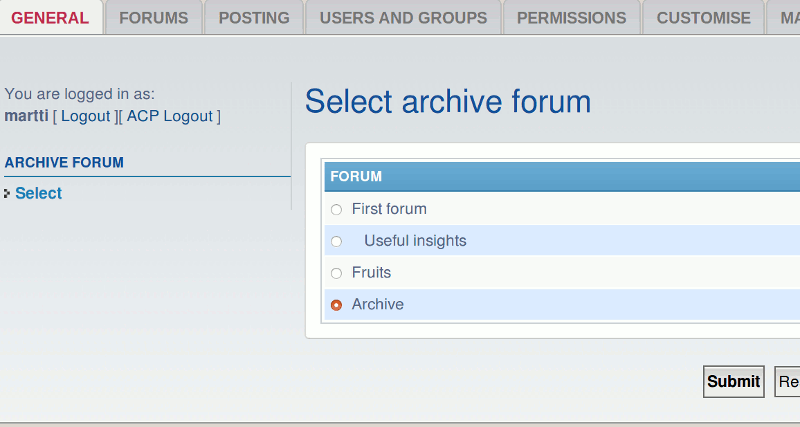

# PhpBB Extension - marttiphpbb Archive Forum

[Topic on phpBB.com](https://www.phpbb.com/community/viewtopic.php?f=456&t=2470326)

## Requirements

phpBB 3.2+ PHP 7+

## Features

With this extension you define one forum as the "Archive" for obsolete topics.
In the "Archive forum" the original forum is shown below the title of each topic.
Two moderator actions are provided "Archive" and "Restore". They depend on the same permission as "Move"(topics).
Note that you still have to set yourself the appropriate permissions for the "Archive Forum" and give it a proper name (suggestion: "Archive"). Normal users should not be able to post in there.

## Quick Install

You can install this on the latest release of phpBB 3.2 by following the steps below:

* Create `marttiphpbb/archiveforum` in the `ext` directory.
* Download and unpack the repository into `ext/marttiphpbb/archiveforum`
* Enable `Archive Forum` in the ACP at `Customise -> Manage extensions`.
* You can start editing the Archive Forum in the Forum ACP for each Forum.

## Uninstall

* Disable `Archive Forum` in the ACP at `Customise -> Extension Management -> Extensions`.
* To permanently uninstall, click `Delete Data`. Optionally delete the `/ext/marttiphpbb/archiveforum` directory.

## Support

* Report bugs and other issues to the [Issue Tracker](https://github.com/marttiphpbb/phpbb-ext-archiveforum/issues).

## License

[GPL-2.0](license.txt)

## Screenshots

### Archived Topic

### Archive Forum

### Confirm Archive

### Confirm Restore

### MCP Forum

### MCP Topic

### Quickmod

### ACP

